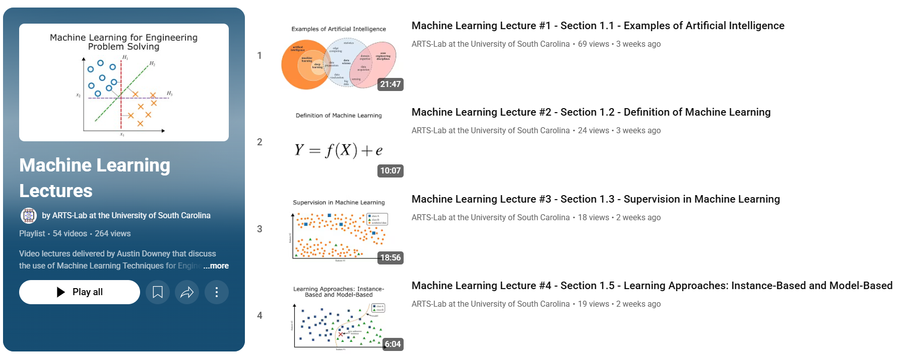
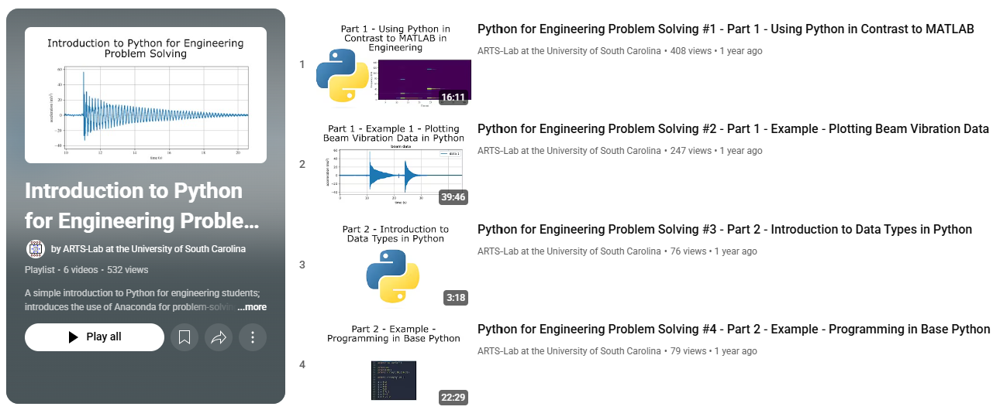

# Machine Learning for Engineering Problem Solving: A Practical Example-driven Guide to Classical Techniques
This text is a free, open-source textbook that introduces traditional machine learning through practical engineering examples. Designed for undergraduate engineering students and readers with limited programming experience, the text uses Python and the scikit-learn library to connect core concepts with hands-on implementation. The book is intended to serve as a self-contained introduction for a college-level machine learning course in an engineering curriculum.

## Published Version 
The most recent published version can be found <a href="https://doi.org/10.31224/4909">here</a>.

A current PDF version of the text (nightly build) can be found <a href="https://github.com/austindowney/Machine-Learning-for-Engineering-Problem-Solving/blob/main/source_material/Machine_Learning_for_Engineering_Problem_Solving.pdf">here</a>.

### Accompanying Video Lectures

Videos of lectures associated with this text are available as a YouTube playlist <a href="https://www.youtube.com/playlist?list=PL-2wJog-EC5-yp3CSFpj2vEcj3Pp6UcoC">here</a>.

  

 Playlist of videos associated with this text.  

This project uses Python programmed through the Spyder IDE managed through the Anaconda platform. A video series that walks the practitioner through this combination of IDE and distribution manager is provided <a href="https://www.youtube.com/playlist?list=PL-2wJog-EC5-wQQUdpc8MjztKZ1kE2ATS">here</a>.

  

 Playlist of videos for learning how to program in Python using Spyder and Anaconda.  

### License

This work is licensed under a Creative Commons Attribution-ShareAlike 4.0 International License [cc-by-sa 4.0].

### Citation

Cite as  
@Article{Downey2025MachineLearningEngineering,  
  author    = {Downey, Austin {R.J.}},  
  title     = {Machine Learning for Engineering Problem Solving: A Practical Example-driven Guide to Classical Techniques},  
  year      = {2025},  
  month     = jul,  
  doi       = {10.31224/4909},  
  publisher = {Open Engineering Inc},  
}

