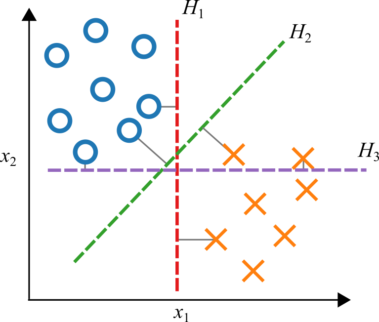
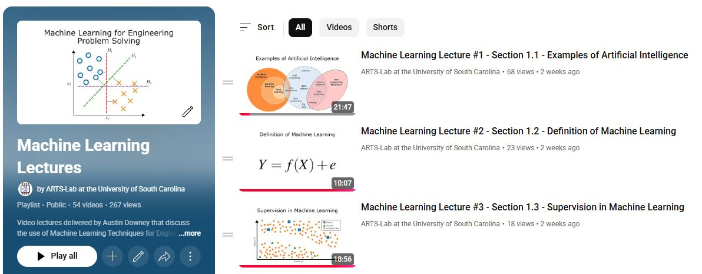

# Machine Learning for Engineering Problem Solving
A free text focused on introducing classical machine learning techniques using the scikit-learn library designed for engineers with limited to no programming experience.

A current PDF version of the text can be found <a href="https://github.com/austindowney/Machine-Learning-for-Engineering-Problem-Solving/blob/main/Machine_Learning_for_Engineering_Problem_Solving.pdf">here</a>.

## Accompanying Video Lectures

Videos of lectures associated with this text are available as a YouTube playlist <a href="https://www.youtube.com/playlist?list=PL-2wJog-EC58uXz1LhpNRmV8nCEvyvoVS">here</a>.

  

 Screenshot of the video lecture that accompanies this repository which can be found <a href="https://www.youtube.com/playlist?list=PL-2wJog-EC5-yp3CSFpj2vEcj3Pp6UcoC">here</a>.  

## License

This work is licensed under a Creative Commons Attribution-ShareAlike 4.0 International License [cc-by-sa 4.0].

## Citation

Cite as  
@Misc{DowneyMachineLearningEngineering,  
  author = {Austin {R.J.} Downey},  
  title  = {Machine Learning for Engineering Problem Solving},  
  url    = {https://github.com/austindowney/Machine-Learning-for-Engineering-Problem-Solving},  
}  

